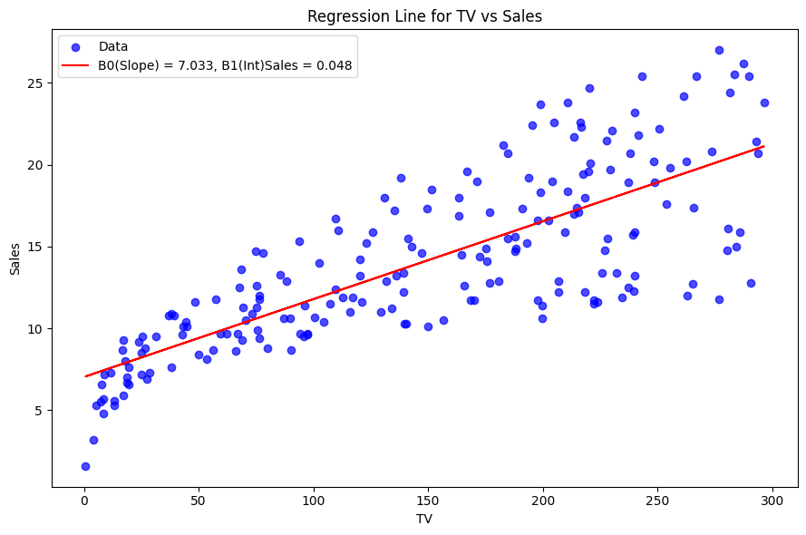
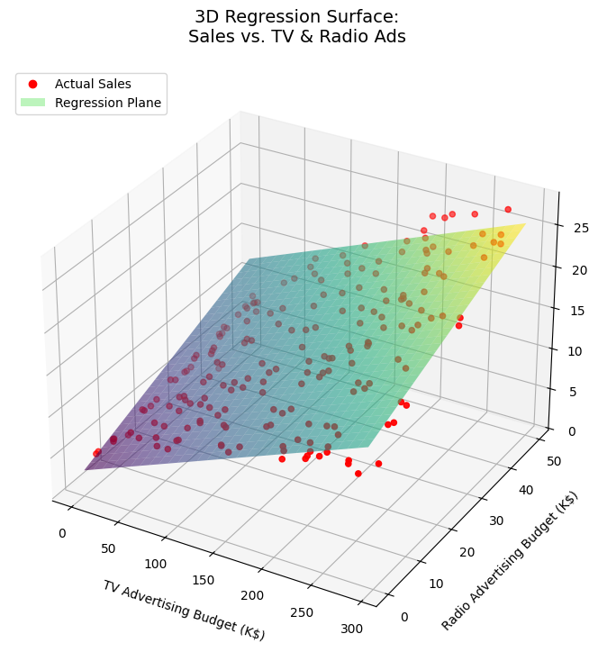

# Linear Regression Case Study – Sales vs. Advertising Budget

This portfolio project provides a comprehensive introduction to **Linear Regression** through hands-on case studies. It is structured in two major parts:

- **Simple Linear Regression**: Develop a model to predict **Sales** based solely on **TV advertising budget**.
- **Multiple Linear Regression**: Extend the model to predict **Sales** using **TV**, **Radio**, and **Newspaper** advertising budgets.

<div align="center">
  
  
</div>

This project is designed as a **beginner-friendly starting point** for those looking to step into the world of **Machine Learning**. It also serves as a solid foundation for anyone who wants a **deep understanding of linear regression**, especially focusing on the following core concepts:

- Ordinary Least Squares (OLS)
- Gradient Descent
- Hypothesis Testing
- Manual Derivations & Explanations (not just library-based modeling)
- And other concepts...

Rather than relying heavily on pre-built libraries, this project emphasizes **manual implementation** and **theoretical insight**, helping you build true intuition about how linear regression works.

**NOTES:**

[1] This project emphasizes the **interpretability**, **theoretical foundation**, and **statistical learning relevance** of linear regression.  
[2] While real-world machine learning problems may call for alternative models, **this project focuses exclusively on linear regression** to maintain clarity and depth.  
[3] Advanced topics such as **regularization techniques** (e.g., Lasso), **train-test splits**, and other topics are intentionally excluded to preserve focus on core regression concepts.

---

## Table of Contents

- [Project Background](#project-background)
- [Project Objective](#project-objective)
- [Important Questions That We Might Seek to Address](#important-questions-that-we-might-seek-to-address)

---

## Project Background

- Suppose we are statistical consultants hired by a client to investigate the relationship between advertising and product sales.
- We are provided with a dataset containing the **sales** of a particular product in **200 different markets**, along with the **advertising budgets** for three different media channels: **TV**, **Radio**, and **Newspaper**.
  - In the **Simple Linear Regression** case study, we analyze the relationship between **Sales** and **TV advertising** only.
  - In the **Multiple Linear Regression** case study, we explore how **Sales** relate to **TV**, **Radio**, and **Newspaper** advertising budgets.
- The client has **full control** over the advertising expenditures across all three media.
- If we find a significant association between advertising and sales, we can advise the client on how to **reallocate or optimize their ad budget** to potentially boost sales.

## Project Objective

- This is designed as portfolio project, and mainly is designed to demonstrate the understanding of linear regression. We may not discuss the motivation of why using linear regression instead of other algorithms for this application.
- Our goal is to develop an accurate model that can be used to predict sales on the basis of the three media budgets.

## Important Questions that We Might Seek to Address

1. Is there a relationship between advertising budget and sales?
2. How strong is the relationship between advertising budget and sales?
3. Which media are associated with sales?
4. How large is the association between each medium and sales?
5. How accurately can we predict future sales?
6. Is the relationship linear?
7. Is there synergy among the advertising media?

## Development Environment Setup (with Virtual Environment)

> Note: These instructions are for macOS. Setup may differ slightly on Windows.

### Recommended Configuration

- Operating System: MacOS

- Recommended Python Version: 3.12.4

- Integrated Development Environment: Visual Studio Code (VS Code)

---

### 1. Creating Virtual Environment

Open your terminal in the project root directory and run:

```bash
python3 -m venv .venv
```

> It’s common practice to name the environment .venv. Most certainly, you could rename it accordingly.

To open a terminal in VS Code, use the shortcut: Ctrl + backtick ()

---

### 2. Active the Virtual Environment(On Windows, the activation command may differ)

Run the following command in your terminal:

```bash
source venv/bin/active
```

---

### 3. Select the Python Interpreter in VS Code

Step 1: Press **`Cmd + Shift + P`** to open the Command Palette  

Step 2: Search for: **`Python: Select Interpreter`**  

Step 3: Choose the one that points to `./.venv`

---

### 4. Install `ipykernel` (Recommended Version: 6.29.5)

```bash
pip install ipykernel==6.29.5
```

> To verify or check your ipykernel installation version: `pip show ipykernel`

---

### 5. Install Project Dependencies

Install all required packages from the `requirements.txt`:

```bash
pip install -r requirements.txt
```

> You can modify or create your own environment by `pip freeze > requirements.txt`  
> you can use command `pip list` to list all installed packages

---

## Attribution & Licensing

This project uses the `Advertising.csv` dataset originally featured in the book:

**"An Introduction to Statistical Learning"** by Gareth James, Daniela Witten, Trevor Hastie, and Robert Tibshirani.  
The dataset is used here strictly for **educational and demonstration purposes**.

- All code in this repository is licensed under the [MIT License](./LICENSE).
- Notebooks and teaching materials are licensed under the [Creative Commons Attribution 4.0 International License (CC BY 4.0)](https://creativecommons.org/licenses/by/4.0/), allowing you to remix, adapt, and build upon the material for any purpose, even commercially, **as long as credit is given to the original author** (Alex Tian).
- The original materials and resources can be found in [ISL Website](https://www.statlearning.com/resources-python)

> If you wish to use the dataset for commercial use beyond education, please refer to the book publisher’s terms and conditions.